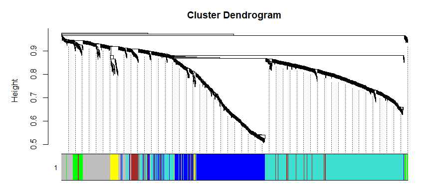
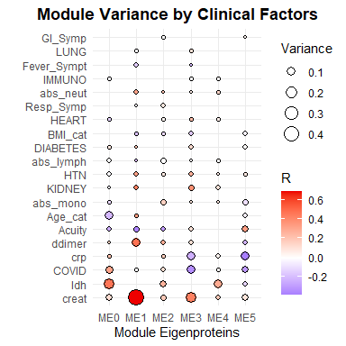

COVID-19 Plasma Proteome
================
Alyssa Pybus
2-4 August 2023

## Summary

Explore the COVID-19 Plasma Proteome [Olink
dataset](https://olink.com/application/mgh-covid-19-study/) from [a
research
study](https://www.cell.com/cell-reports-medicine/fulltext/S2666-3791(21)00115-4#%20)
conducted by Massachusetts General Hospital (Filbin et al. 2021). My
approach was to conduct an exploratory analysis using weighted
correlation network analysis / weighted gene co-expression analysis
(WGCNA) to pull out major trends in the data.

#### Setup

### Load in the Olink NPX data

NPX = Normalized Protein Expression

<a
href="https://olink.com/faq/how-is-the-npx-value-calculated-in-explore/"
class="uri">Pre-processing steps by Olink</a>

``` r
df_in = rio::import("MGH_COVID_OLINK_NPX.txt")
df_in$NPX[df_in$QC_Warning=="WARN" | df_in$Assay_Warning=="WARN"] = NA

glimpse(df_in)
```

    ## Rows: 1,271,808
    ## Columns: 16
    ## $ SampleID      <chr> "1_D0", "1_D0", "1_D0", "1_D0", "1_D0", "1_D0", "1_D0", …
    ## $ subject_id    <int> 1, 1, 1, 1, 1, 1, 1, 1, 1, 1, 1, 1, 1, 1, 1, 1, 1, 1, 1,…
    ## $ Timepoint     <chr> "D0", "D0", "D0", "D0", "D0", "D0", "D0", "D0", "D0", "D…
    ## $ Index         <int> 56, 56, 56, 56, 56, 56, 56, 56, 56, 56, 56, 56, 56, 56, …
    ## $ OlinkID       <chr> "OID21311", "OID20921", "OID21280", "OID21269", "OID2015…
    ## $ UniProt       <chr> "Q9BTE6", "Q96IU4", "P00519", "P09110", "P16112", "Q9BYF…
    ## $ Assay         <chr> "AARSD1", "ABHD14B", "ABL1", "ACAA1", "ACAN", "ACE2", "A…
    ## $ MissingFreq   <dbl> 0.0000, 0.0000, 0.0013, 0.1248, 0.0000, 0.0561, 0.8127, …
    ## $ Panel         <chr> "Oncology", "Neurology", "Oncology", "Oncology", "Cardio…
    ## $ Panel_Lot_Nr  <chr> "B04404", "B04406", "B04404", "B04404", "B04405", "B0440…
    ## $ PlateID       <chr> "20200772_Plate5", "20200772_Plate5", "20200772_Plate5",…
    ## $ QC_Warning    <chr> "PASS", "PASS", "PASS", "PASS", "PASS", "PASS", "PASS", …
    ## $ Assay_Warning <chr> "PASS", "PASS", "PASS", "PASS", "PASS", "PASS", "PASS", …
    ## $ Normalization <chr> "Intensity", "Intensity", "Intensity", "Intensity", "Int…
    ## $ LOD           <dbl> -1.0810, -1.4574, -2.4697, -0.2027, -3.3481, -1.9055, 0.…
    ## $ NPX           <dbl> 1.9024, -0.2625, 0.2659, 0.5311, -2.0366, -1.4261, -0.24…

### Load in the clinical data

``` r
clinical = rio::import("MGH_COVID_Clinical_Info.txt")

glimpse(clinical)
```

    ## Rows: 384
    ## Columns: 44
    ## $ subject_id      <int> 1, 2, 3, 4, 5, 6, 7, 8, 9, 10, 11, 12, 13, 14, 15, 16,…
    ## $ COVID           <int> 1, 1, 1, 1, 1, 1, 1, 0, 1, 0, 1, 1, 1, 1, 1, 0, 1, 1, …
    ## $ Age_cat         <int> 1, 2, 3, 1, 3, 1, 2, 4, 5, 2, 3, 2, 4, 4, 4, 3, 3, 2, …
    ## $ BMI_cat         <int> 4, 2, 4, 2, 3, 1, 2, 3, 2, 2, 2, 4, 4, 3, 2, 3, 1, 2, …
    ## $ HEART           <int> 0, 0, 0, 0, 0, 1, 0, 0, 0, 0, 0, 0, 1, 0, 1, 0, 0, 0, …
    ## $ LUNG            <int> 0, 0, 1, 0, 0, 0, 0, 0, 1, 0, 0, 0, 1, 0, 0, 1, 0, 0, …
    ## $ KIDNEY          <int> 0, 0, 0, 0, 0, 0, 0, 0, 1, 0, 0, 0, 0, 1, 0, 0, 0, 0, …
    ## $ DIABETES        <int> 0, 0, 0, 0, 1, 0, 1, 1, 0, 0, 0, 1, 1, 0, 0, 0, 0, 0, …
    ## $ HTN             <int> 0, 0, 0, 0, 1, 0, 0, 1, 1, 0, 0, 0, 1, 1, 1, 1, 1, 0, …
    ## $ IMMUNO          <int> 0, 0, 0, 0, 0, 0, 0, 1, 0, 0, 0, 0, 0, 1, 1, 1, 0, 0, …
    ## $ Resp_Symp       <int> 1, 1, 1, 1, 1, 1, 1, 1, 1, 1, 1, 1, 1, 1, 1, 0, 1, 1, …
    ## $ Fever_Sympt     <int> 1, 1, 0, 1, 1, 0, 1, 1, 0, 1, 1, 1, 0, 1, 1, 0, 1, 1, …
    ## $ GI_Symp         <int> 1, 1, 1, 0, 1, 0, 0, 1, 1, 0, 1, 0, 1, 1, 0, 0, 0, 1, …
    ## $ D0_draw         <int> 1, 1, 1, 1, 1, 1, 1, 1, 1, 1, 1, 1, 1, 1, 1, 1, 1, 1, …
    ## $ D3_draw         <int> 1, 1, 1, 1, 1, 1, 1, 0, 1, 0, 0, 1, 1, 1, 1, 0, 1, 1, …
    ## $ D7_draw         <int> 0, 0, 0, 0, 1, 1, 0, 0, 0, 0, 0, 1, 0, 1, 1, 0, 0, 0, …
    ## $ DE_draw         <int> 0, 0, 0, 0, 0, 0, 0, 0, 0, 0, 0, 1, 0, 0, 1, 0, 0, 0, …
    ## $ Acuity_0        <int> 3, 3, 3, 3, 3, 3, 3, 3, 3, 4, 5, 2, 3, 3, 2, 2, 4, 4, …
    ## $ Acuity_3        <int> 4, 3, 3, 3, 3, 3, 3, 3, 3, 4, 5, 2, 3, 2, 2, 2, 4, 4, …
    ## $ Acuity_7        <int> 5, 5, 5, 5, 3, 3, 5, 5, 5, 5, 5, 2, 5, 2, 2, 3, 5, 5, …
    ## $ Acuity_28       <int> 5, 5, 5, 5, 5, 5, 5, 5, 5, 5, 5, 5, 5, 2, 1, 5, 5, 5, …
    ## $ Acuity_max      <int> 3, 3, 3, 3, 3, 3, 3, 3, 3, 4, 4, 2, 3, 2, 1, 2, 4, 4, …
    ## $ abs_neut_0_cat  <int> 3, 3, 3, 2, 3, 3, 3, 5, 3, 1, 3, 3, 2, 3, 5, 4, 3, 3, …
    ## $ abs_lymph_0_cat <int> 2, 3, 3, 2, 5, 2, 2, 1, 2, 3, 3, 2, 3, 1, 1, 4, 3, 4, …
    ## $ abs_mono_0_cat  <int> 2, 3, 2, 2, 3, 1, 3, 4, 3, 2, 2, 2, 3, 2, 5, 3, 2, 1, …
    ## $ creat_0_cat     <int> 2, 2, 2, 2, 2, 2, 2, 2, 5, 1, 2, 1, 2, 4, 2, 3, 2, 1, …
    ## $ crp_0_cat       <int> 1, 3, 4, 1, 4, 3, 5, 2, 3, 1, NA, 5, 1, 4, 5, 1, 3, 2,…
    ## $ ddimer_0_cat    <int> 1, 2, 3, 2, 3, 3, 3, 3, 4, 1, NA, 2, 3, 3, 3, 4, 2, 2,…
    ## $ ldh_0_cat       <int> 2, 2, 4, 2, 3, 4, 3, 2, 5, 2, NA, 5, 2, 2, 3, 5, 4, 3,…
    ## $ Trop_72h        <int> 0, 0, 0, 0, 0, 0, 0, 0, 1, 0, 0, 0, 0, 0, 0, 1, 0, 0, …
    ## $ abs_neut_3_cat  <int> 2, 2, 3, 3, 3, 3, 3, 3, 2, 2, NA, 4, 2, 2, 5, 3, 3, 2,…
    ## $ abs_lymph_3_cat <int> 4, 4, 4, 4, 5, 4, 2, 3, 2, 3, NA, 1, 4, 2, 2, 1, 3, 4,…
    ## $ abs_mono_3_cat  <int> 2, 3, 3, 2, 2, 1, 2, 3, 2, 2, NA, 2, 3, 2, 2, 2, 3, 3,…
    ## $ creat_3_cat     <int> 1, 1, 2, 1, 1, 1, 2, 2, 3, 1, NA, 3, 1, 4, 1, 2, 1, 1,…
    ## $ crp_3_cat       <int> 1, 2, 3, 2, 5, 4, 4, 3, 3, NA, NA, 4, NA, 4, 3, NA, 3,…
    ## $ ddimer_3_cat    <int> 1, NA, 2, 2, 3, 3, 3, 2, 3, NA, NA, 4, NA, 2, 3, NA, 3…
    ## $ ldh_3_cat       <int> 1, NA, 3, 3, NA, 5, 3, 1, 2, NA, NA, 4, NA, 2, 2, NA, …
    ## $ abs_neut_7_cat  <int> NA, NA, NA, NA, 3, 3, NA, NA, NA, NA, NA, 3, NA, 2, 5,…
    ## $ abs_lymph_7_cat <int> NA, NA, NA, NA, 5, 3, NA, NA, NA, NA, NA, 3, NA, 1, 2,…
    ## $ abs_mono_7_cat  <int> NA, NA, NA, NA, 3, 2, NA, NA, NA, NA, NA, 3, NA, 2, 5,…
    ## $ creat_7_cat     <int> NA, NA, NA, NA, 1, 1, NA, NA, NA, NA, NA, 3, NA, 4, 1,…
    ## $ crp_7_cat       <int> NA, NA, NA, NA, 4, 4, NA, NA, NA, NA, NA, NA, NA, 1, N…
    ## $ ddimer_7_cat    <int> NA, NA, NA, NA, 4, 5, NA, NA, NA, NA, NA, 4, NA, 2, 4,…
    ## $ ldh_7_cat       <int> NA, NA, NA, NA, 3, 5, NA, NA, NA, NA, NA, 3, NA, 3, NA…

### Format the data for follow-on analysis

#### Observations matrix

In this chunk, I create a matrix where rows (observations) are a single
plasma sample (single patient on a single day) and columns are measured
proteins (the input configuration for WGCNA). I preferentially use
OlinkID because the Assay and UnitProt identifiers are not unique.

``` r
df_obs = df_in %>% 
  filter(subject_id > 0) %>%
  select(SampleID,subject_id,Timepoint,OlinkID,NPX) %>%
  spread(key="OlinkID",value="NPX")

obs_mat = df_obs[,4:ncol(df_obs)] %>% as.matrix()
rownames(obs_mat) = df_obs$SampleID

glimpse(df_obs[,1:8])
```

    ## Rows: 784
    ## Columns: 8
    ## $ SampleID   <chr> "1_D0", "1_D3", "10_D0", "100_D0", "100_D3", "101_D0", "101…
    ## $ subject_id <int> 1, 1, 10, 100, 100, 101, 101, 101, 102, 102, 102, 102, 103,…
    ## $ Timepoint  <chr> "D0", "D3", "D0", "D0", "D3", "D0", "D3", "D7", "D0", "D3",…
    ## $ OID20049   <dbl> -1.7308, -1.4436, -1.6194, -1.7974, -2.3159, -1.2428, 1.156…
    ## $ OID20050   <dbl> -4.1338, -2.4681, -2.6296, -2.6118, -3.0080, -4.1360, -3.03…
    ## $ OID20051   <dbl> 0.3077, 0.2470, 0.0642, 0.3462, 0.3658, -0.0750, 0.2479, 4.…
    ## $ OID20052   <dbl> -0.7121, -0.0204, -0.3500, -0.1211, -0.2567, -0.0241, -0.10…
    ## $ OID20053   <dbl> 0.0293, 0.6847, -0.1244, 0.7522, 1.6322, 0.4881, 0.2432, 3.…

#### Information (clinical) matrix

I also create a matching “info” data frame with sample rows in identical
order to use as metadata for follow-on analyses.

``` r
info = df_obs %>%
  select(SampleID,subject_id,Timepoint) %>%
  left_join(clinical,by = "subject_id") %>%
  mutate(subject_id = factor(subject_id))

# Create new variables in info for concurrent measurements
replace = colnames(info)[which(str_detect(colnames(info),"_0"))] %>% str_c("_")
new_var = gsub("_0.*","",x = replace)
for(var in new_var){
  info$new = case_when(
    info$Timepoint == "D0" ~ info[,str_detect(colnames(info),str_c(var,"_0"))],
    info$Timepoint == "D3" ~ info[,str_detect(colnames(info),str_c(var,"_3"))],
    info$Timepoint == "D7" ~ info[,str_detect(colnames(info),str_c(var,"_7"))],
  )
  colnames(info)[which(colnames(info)=="new")] = var
}

glimpse(info)
```

    ## Rows: 784
    ## Columns: 54
    ## $ SampleID        <chr> "1_D0", "1_D3", "10_D0", "100_D0", "100_D3", "101_D0",…
    ## $ subject_id      <fct> 1, 1, 10, 100, 100, 101, 101, 101, 102, 102, 102, 102,…
    ## $ Timepoint       <chr> "D0", "D3", "D0", "D0", "D3", "D0", "D3", "D7", "D0", …
    ## $ COVID           <int> 1, 1, 0, 1, 1, 1, 1, 1, 1, 1, 1, 1, 1, 0, 0, 1, 1, 1, …
    ## $ Age_cat         <int> 1, 1, 2, 1, 1, 2, 2, 2, 5, 5, 5, 5, 1, 5, 3, 2, 2, 2, …
    ## $ BMI_cat         <int> 4, 4, 2, 4, 4, 1, 1, 1, 3, 3, 3, 3, 5, 3, 3, 2, 2, 2, …
    ## $ HEART           <int> 0, 0, 0, 0, 0, 0, 0, 0, 0, 0, 0, 0, 0, 1, 1, 0, 0, 0, …
    ## $ LUNG            <int> 0, 0, 0, 0, 0, 0, 0, 0, 0, 0, 0, 0, 0, 0, 1, 0, 0, 0, …
    ## $ KIDNEY          <int> 0, 0, 0, 0, 0, 0, 0, 0, 0, 0, 0, 0, 0, 0, 0, 0, 0, 0, …
    ## $ DIABETES        <int> 0, 0, 0, 0, 0, 0, 0, 0, 0, 0, 0, 0, 0, 0, 0, 1, 1, 1, …
    ## $ HTN             <int> 0, 0, 0, 0, 0, 0, 0, 0, 1, 1, 1, 1, 0, 1, 1, 0, 0, 0, …
    ## $ IMMUNO          <int> 0, 0, 0, 0, 0, 0, 0, 0, 0, 0, 0, 0, 0, 0, 0, 0, 0, 0, …
    ## $ Resp_Symp       <int> 1, 1, 1, 1, 1, 1, 1, 1, 1, 1, 1, 1, 1, 1, 1, 1, 1, 1, …
    ## $ Fever_Sympt     <int> 1, 1, 1, 1, 1, 1, 1, 1, 0, 0, 0, 0, 0, 0, 0, 1, 1, 1, …
    ## $ GI_Symp         <int> 1, 1, 0, 0, 0, 1, 1, 1, 1, 1, 1, 1, 1, 0, 0, 0, 0, 0, …
    ## $ D0_draw         <int> 1, 1, 1, 1, 1, 1, 1, 1, 1, 1, 1, 1, 1, 1, 1, 1, 1, 1, …
    ## $ D3_draw         <int> 1, 1, 0, 1, 1, 1, 1, 1, 1, 1, 1, 1, 0, 0, 0, 1, 1, 1, …
    ## $ D7_draw         <int> 0, 0, 0, 0, 0, 1, 1, 1, 1, 1, 1, 1, 0, 0, 0, 1, 1, 1, …
    ## $ DE_draw         <int> 0, 0, 0, 0, 0, 0, 0, 0, 1, 1, 1, 1, 0, 0, 0, 0, 0, 0, …
    ## $ Acuity_0        <int> 3, 3, 4, 3, 3, 3, 3, 3, 4, 4, 4, 4, 5, 5, 5, 2, 2, 2, …
    ## $ Acuity_3        <int> 4, 4, 4, 4, 4, 3, 3, 3, 2, 2, 2, 2, 5, 5, 5, 2, 2, 2, …
    ## $ Acuity_7        <int> 5, 5, 5, 5, 5, 3, 3, 3, 2, 2, 2, 2, 5, 5, 5, 2, 2, 2, …
    ## $ Acuity_28       <int> 5, 5, 5, 5, 5, 5, 5, 5, 1, 1, 1, 1, 5, 5, 5, 1, 1, 1, …
    ## $ Acuity_max      <int> 3, 3, 4, 3, 3, 3, 3, 3, 1, 1, 1, 1, 5, 5, 3, 1, 1, 1, …
    ## $ abs_neut_0_cat  <int> 3, 3, 1, 3, 3, 3, 3, 3, 2, 2, 2, 2, 3, 3, 4, 3, 3, 3, …
    ## $ abs_lymph_0_cat <int> 2, 2, 3, 3, 3, 3, 3, 3, 1, 1, 1, 1, 5, 2, 4, 2, 2, 2, …
    ## $ abs_mono_0_cat  <int> 2, 2, 2, 2, 2, 2, 2, 2, 1, 1, 1, 1, 2, 4, 5, 3, 3, 3, …
    ## $ creat_0_cat     <int> 2, 2, 1, 2, 2, 2, 2, 2, 1, 1, 1, 1, 1, 2, 2, 1, 1, 1, …
    ## $ crp_0_cat       <int> 1, 1, 1, 1, 1, 3, 3, 3, 3, 3, 3, 3, NA, 1, 3, 4, 4, 4,…
    ## $ ddimer_0_cat    <int> 1, 1, 1, 5, 5, 2, 2, 2, 2, 2, 2, 2, 2, 2, 4, 2, 2, 2, …
    ## $ ldh_0_cat       <int> 2, 2, 2, 4, 4, 3, 3, 3, 2, 2, 2, 2, NA, 2, 1, 4, 4, 4,…
    ## $ Trop_72h        <int> 0, 0, 0, 0, 0, 0, 0, 0, 0, 0, 0, 0, 0, 0, 0, 0, 0, 0, …
    ## $ abs_neut_3_cat  <int> 2, 2, 2, 2, 2, 2, 2, 2, 3, 3, 3, 3, NA, NA, NA, 3, 3, …
    ## $ abs_lymph_3_cat <int> 4, 4, 3, 5, 5, 3, 3, 3, 1, 1, 1, 1, NA, NA, NA, 3, 3, …
    ## $ abs_mono_3_cat  <int> 2, 2, 2, 2, 2, 2, 2, 2, 1, 1, 1, 1, NA, NA, NA, 4, 4, …
    ## $ creat_3_cat     <int> 1, 1, 1, 2, 2, 2, 2, 2, 3, 3, 3, 3, NA, NA, NA, 1, 1, …
    ## $ crp_3_cat       <int> 1, 1, NA, 1, 1, 3, 3, 3, 5, 5, 5, 5, NA, NA, NA, 5, 5,…
    ## $ ddimer_3_cat    <int> 1, 1, NA, 4, 4, 2, 2, 2, 3, 3, 3, 3, NA, NA, NA, 4, 4,…
    ## $ ldh_3_cat       <int> 1, 1, NA, 3, 3, 3, 3, 3, 5, 5, 5, 5, NA, NA, NA, 5, 5,…
    ## $ abs_neut_7_cat  <int> NA, NA, NA, NA, NA, 2, 2, 2, 3, 3, 3, 3, NA, NA, NA, N…
    ## $ abs_lymph_7_cat <int> NA, NA, NA, NA, NA, 4, 4, 4, 2, 2, 2, 2, NA, NA, NA, N…
    ## $ abs_mono_7_cat  <int> NA, NA, NA, NA, NA, 3, 3, 3, 2, 2, 2, 2, NA, NA, NA, N…
    ## $ creat_7_cat     <int> NA, NA, NA, NA, NA, 2, 2, 2, 2, 2, 2, 2, NA, NA, NA, 1…
    ## $ crp_7_cat       <int> NA, NA, NA, NA, NA, 1, 1, 1, 5, 5, 5, 5, NA, NA, NA, 4…
    ## $ ddimer_7_cat    <int> NA, NA, NA, NA, NA, 2, 2, 2, 3, 3, 3, 3, NA, NA, NA, 3…
    ## $ ldh_7_cat       <int> NA, NA, NA, NA, NA, 3, 3, 3, 4, 4, 4, 4, NA, NA, NA, 5…
    ## $ Acuity          <int> 3, 4, 4, 3, 4, 3, 3, 3, 4, 2, 2, NA, 5, 5, 5, 2, 2, 2,…
    ## $ abs_neut        <int> 3, 2, 1, 3, 2, 3, 2, 2, 2, 3, 3, NA, 3, 3, 4, 3, 3, NA…
    ## $ abs_lymph       <int> 2, 4, 3, 3, 5, 3, 3, 4, 1, 1, 2, NA, 5, 2, 4, 2, 3, NA…
    ## $ abs_mono        <int> 2, 2, 2, 2, 2, 2, 2, 3, 1, 1, 2, NA, 2, 4, 5, 3, 4, NA…
    ## $ creat           <int> 2, 1, 1, 2, 2, 2, 2, 2, 1, 3, 2, NA, 1, 2, 2, 1, 1, 1,…
    ## $ crp             <int> 1, 1, 1, 1, 1, 3, 3, 1, 3, 5, 5, NA, NA, 1, 3, 4, 5, 4…
    ## $ ddimer          <int> 1, 1, 1, 5, 4, 2, 2, 2, 2, 3, 3, NA, 2, 2, 4, 2, 4, 3,…
    ## $ ldh             <int> 2, 1, 2, 4, 3, 3, 3, 3, 2, 5, 4, NA, NA, 2, 1, 4, 5, 5…

## Weighted “Gene” Co-expression Network Analysis

WGCNA identifies modules of co-varying analytes (usually genes but in
this case, proteins) to identify broad trends within the data. The
functions come from the [WGCNA
package](https://cran.r-project.org/web/packages/WGCNA/index.html)
available on CRAN (Langfelder and Horvath 2008).

### Pick soft threshold power

The function WGCNA::pickSoftThreshold() helps us to select a power to
apply to the correlation matrix and thus reduce noise within the data.
The most common method for power selection is to select the lowest
integer for which R^2 \> 0.80 for the network with a scale-free topology
model.

``` r
# ~~~ Select threshold power ~~~~~~~~~
sft = WGCNA::pickSoftThreshold(obs_mat, verbose = 5)
```

    ## 

    ## pickSoftThreshold: will use block size 1472.
    ##  pickSoftThreshold: calculating connectivity for given powers...
    ##    ..working on genes 1 through 1472 of 1472
    ##    Power SFT.R.sq  slope truncated.R.sq mean.k. median.k. max.k.
    ## 1      1    0.339  0.479          0.695  346.00  362.0000  604.0
    ## 2      2    0.326 -0.374          0.681  136.00  130.0000  326.0
    ## 3      3    0.553 -0.721          0.634   69.30   54.1000  208.0
    ## 4      4    0.796 -0.781          0.770   41.30   25.7000  146.0
    ## 5      5    0.959 -0.862          0.949   27.30   13.4000  118.0
    ## 6      6    0.988 -0.928          0.986   19.40    7.4300  101.0
    ## 7      7    0.991 -0.979          0.990   14.50    4.2600   89.4
    ## 8      8    0.990 -0.995          0.988   11.20    2.4400   80.0
    ## 9      9    0.983 -1.020          0.980    8.97    1.4200   72.1
    ## 10    10    0.987 -1.030          0.984    7.32    0.9160   65.4
    ## 11    12    0.980 -1.040          0.975    5.12    0.3780   54.6
    ## 12    14    0.944 -1.070          0.928    3.76    0.1760   46.3
    ## 13    16    0.959 -1.050          0.952    2.86    0.0774   39.7
    ## 14    18    0.924 -1.070          0.914    2.24    0.0367   34.3
    ## 15    20    0.964 -1.060          0.963    1.79    0.0170   30.3

``` r
plot(sft$fitIndices[,1], -sign(sft$fitIndices[,3])*sft$fitIndices[,2],
     xlab="Soft Threshold (power)",ylab="Scale Free Topology Model Fit,signed R^2",type="n",
     main = paste("Scale independence"));
text(sft$fitIndices[,1], -sign(sft$fitIndices[,3])*sft$fitIndices[,2],
     labels=sft$fitIndices$Power,cex=0.9,col="red");
abline(h=0.80,col="red")
```


``` r
power = sft$fitIndices$Power[sft$fitIndices$SFT.R.sq>0.8] %>% min()
```

A threshold power of 5 was chosen since it was the smallest threshold
that resulted in a scale-free local max R^2 value greater than 0.80

### Scale free topology visualization

``` r
# Adjacency matrix is the correlation coefficient to power beta (determined above)
adjacency_mat=abs(cor(obs_mat,use="p"))^power
# Connectivity k is the sum of all adjacencies of a protein
k=as.vector(apply(adjacency_mat,2,sum, na.rm=T))

# Visualize the histogram of k values and the power law distribution
par(mfrow=c(1,2))
hist(k)
WGCNA::scaleFreePlot(k, main="Check scale free topology\n") %>% invisible()
```


### Run WGCNA to calculate modules

Parameters for blockwiseModules() are adapted from [this
paper](https://www.nature.com/articles/s41593-021-00999-y) (Johnson et
al. 2022).

``` r
# Run WGCNA #################
library("WGCNA")
net = WGCNA::blockwiseModules(obs_mat, 
                              power = power, 
                              networkType = "signed",
                              deepSplit = 4,
                              minModuleSize = 20,
                              TOMDenom = "mean",
                              corType = "bicor",
                              mergeCutHeight = 0.07,
                              reassignThreshold = 0.05,
                              numericLabels = T,
                              verbose = 3,
                              maxBlockSize = 1500)
# saveRDS(net,"net.rds")
```

### Set up color scheme

``` r
colors_num =net$colors # save original number labels
net[["colors"]] = labels2colors(net$colors) # set color labels
color_code = data.frame(table(colors_num)) # create data frame to transition between numbers and colors
color_code$color = labels2colors(color_code$colors_num %>% as.character() %>% as.numeric())

table(net$colors)
```

    ## 
    ##      blue     brown     green      grey turquoise    yellow 
    ##       390        76        48       206       702        50

### Visualize the module dendrogram

``` r
WGCNA::plotDendroAndColors(net$dendrograms[[1]], net$colors[net$blockGenes[[1]]],
                    dendroLabels = FALSE,hang=0.03,addGuide = TRUE,guideHang = 0.05)
```



Using deepSplit = 4 (highest sensitivity level for module reassignment)
usually gives somewhat messy module dendrograms, but in my experience
has led to greater biological relevance within modules.

### Assess similarity between modules

``` r
ME_tree = hclust(dist(t(net$MEs)), method = "average")
MEs = net$MEs[,ME_tree$order]
ME_mat = MEs %>% as.matrix()

plot(ME_tree, main = "ME clustering", sub="", xlab="",)
```


ME3 and 5 are quite similar to each other and distinct from all other
modules.

### Variance partition analysis of modules

Variance Partition Analysis (VPA) allows us to identify the major
sources of variance within our data. We specify information about each
sample (i.e. COVID status, age group, etc.) and the functions calculate
what proportion of each ME’s variance can be explained by each factor.
This analysis uses the [variancePartition
package](https://bioconductor.org/packages/release/bioc/html/variancePartition.html)
available on Bioconductor (Hoffman and Schadt 2016).

#### VPA - Canonical correlation analysis

``` r
form <- ~ COVID + Acuity + Age_cat + BMI_cat + HEART + LUNG + KIDNEY + DIABETES + HTN + IMMUNO + Resp_Symp + Fever_Sympt + GI_Symp + abs_neut + abs_lymph + abs_mono + creat + crp + ddimer + ldh
C = variancePartition::canCorPairs(form,info)
variancePartition::plotCorrMatrix( C )
```


This heatmap is showing that there’s a fair amount of co-variance
between many of the quantitative measurements (crp, ldh, ddimer) and
acuity, as well as between creatine and kidney disease. This might cause
issues in the variance partition analysis, which attempts to separate
each source of variance from all others and determine an estimated %
contribution from each one. For co-varying factors, it’s harder to
separate the two and I’ve found that VPA usually tends to pick the
stronger factor and give it the lion’s share of the variance at the
expense of the weaker co-variate.

#### VPA - All variables

``` r
vp_all <- variancePartition::fitExtractVarPartModel(t(MEs), form, info )
variancePartition::plotPercentBars(vp_all[order(vp_all$Residuals),] )
```


Probably the most notable feature here is the impact of creatine on
modules 1 and 3. Module 1 seems to have a slight impact from acuity, but
module 3 is more influenced by COVID status. Module 0 is formed from all
the unassigned proteins, so this one isn’t particularly meaningful.

#### VPA - Qualitative variables

Because the quantitative measurements seemed to eclipse much of the
variance from qualitative factors, I decided to do two more VPAs with
factor subsets of both groups. I was interested to see how much of the
modules could be explained without data from a blood draw (what are the
risk factors behind each subset of proteins acting in a distinct
pattern?).

``` r
form_qual <- ~ COVID + Acuity + Age_cat + BMI_cat + HEART + LUNG + KIDNEY + DIABETES + HTN + IMMUNO + Resp_Symp + Fever_Sympt + GI_Symp
vp_qual <- variancePartition::fitExtractVarPartModel(t(MEs), form_qual, info )
variancePartition::plotPercentBars(vp_qual[order(vp_qual$Residuals),] )
```


ME1 was again the most interesting to me. It’s acuity score shot up, as
it was likely being masked by the co-varying quantitative variables
“taking” its variance. It’s also interesting to see such a strong
contribution of pre-existing kidney disease. ME3 still shows a
contribution from COVID, but it’s notably not really associated with
acuity. Kidney disease also seems to impact ME3.

#### VPA - Quantitative variables

Next, we’ll look at ME variance for quantitative variables.

``` r
form_quant <- ~ abs_neut + abs_lymph + abs_mono + creat + crp + ddimer + ldh
vp_quant <- variancePartition::fitExtractVarPartModel(t(MEs), form_quant, info )
variancePartition::plotPercentBars(vp_quant[order(vp_quant$Residuals),] )
```


This looks much like the all-factors VPA. At this point I’m really
interested by what’s going on with creatine in particular.

### Linear Regressions

To assess the directionality of the relationships between each variable
and each module, I next conduct ordinary linear regression and save the
correlation coefficients and p-values to combine with the variance data.

``` r
factors = colnames(vp_all)[colnames(vp_all) != "Residuals"]
factor_mat = info %>%
  select(all_of(factors)) %>%
  as.matrix()
# identical(info$SampleID,rownames(ME_mat))
regressions = cbind(ME_mat,factor_mat)
corMat= Hmisc::rcorr(regressions)
corCoefs = corMat$r %>%
  as_tibble() %>%
  mutate(ME = rownames(corMat$r)) %>%
  filter(ME %in% colnames(MEs)) %>%
  select(ME,factors) %>%
  gather(key="Factor",value="R",2:ncol(.))
cor_p = corMat$P %>%
  as_tibble() %>%
  mutate(ME = rownames(corMat$P)) %>%
  filter(ME %in% colnames(MEs)) %>%
  select(ME,factors) %>%
  gather(key="Factor",value="pvalue",2:ncol(.))
cor_out = full_join(corCoefs,cor_p)

glimpse(cor_out)
```

    ## Rows: 120
    ## Columns: 4
    ## $ ME     <chr> "ME3", "ME5", "ME4", "ME0", "ME1", "ME2", "ME3", "ME5", "ME4", …
    ## $ Factor <chr> "COVID", "COVID", "COVID", "COVID", "COVID", "COVID", "Acuity",…
    ## $ R      <dbl> -0.334942001, -0.312316918, 0.038972627, 0.319713730, 0.0053977…
    ## $ pvalue <dbl> 0.000000e+00, 0.000000e+00, 2.757543e-01, 0.000000e+00, 8.80057…

### Bubble Plot of Variance and Correlation Coefficients by Module

To visualize all the patterns we’ve identified so far, I use a bubble
diagram that shows each module, the estimated percent of variation from
each factor, and the linear regression correlation coefficients.

``` r
vp_tidy = vp_all 
vp_tidy$ME = rownames(vp_all)
vp_tidy = vp_tidy %>%
  gather(key="Factor",value="Variance",1:ncol(vp_all)) %>%
  left_join(cor_out)

# This section gives me an ordered list of factors by their total variance explained
# I use it to put my bubble plot rows in order, with most important by the axis labels
order_factor = vp_tidy %>%
  group_by(Factor) %>%
  summarise(sum(Variance)) %>%
  arrange(-`sum(Variance)`) 

vp_tidy$Variance[vp_tidy$Variance<0.001]  = NA
vp_tidy$Factor = factor(vp_tidy$Factor,levels = order_factor$Factor)

ggplot(filter(vp_tidy,Factor!="Residuals"),aes(y=Factor,x=ME,size=Variance,fill=R)) +
  geom_point(color="black",shape=21) +
  theme_minimal() +
  scale_fill_gradient2(low="blue",high="red2",mid = "white") +
  ylab("") +
  xlab("Module Eigenproteins") +
  ggtitle("Module Variance by Clinical Factors") +
  theme(plot.title = element_text(face="bold",hjust=0.5) )
```



### Proteins within modules

To get an idea of the biological relevance of the modules, I’ll put
together a list of the top-correlated proteins in each module and run a
gene set enrichment analysis for Gene Ontology Biological Processes in
PANTHER 17.

The module membership score, kME, is the correlation coefficient of each
protein within the module to the module eigenprotein (ME), or first
principal component of that module.

``` r
# Create data frame of all protein identifiers (OnlinkID, UniProt, Assay)
protein_codes = df_in %>%
  select(OlinkID,Assay,UniProt) %>%
  distinct()

# Pull the kME values
kME = WGCNA::signedKME(datExpr = obs_mat,datME = MEs) # wide format
kME$OlinkID = rownames(kME) # add column for OlinkID
kME_obs =  gather(kME,key="ME",value="kME",1:ncol(MEs)) # long format

# Create data frame of proteins with the module they belong to (color and num)
proteins = data.frame(OlinkID=names(net$unmergedColors),MEcol=net$colors)
proteins$ME = color_code$colors_num[match(proteins$MEcol,color_code$color)] %>% 
  str_c("kME",.)
# add in their kME value and other identifiers (UnitProt, Assay)
proteins_kME = left_join(proteins,kME_obs) %>%
  left_join(protein_codes)

# Select top module members (kME gated) for using in GSEA
top_proteins = proteins_kME %>%
  filter(kME > 0.6)
table(top_proteins$ME)
```

    ## 
    ## kME0 kME1 kME2 kME3 kME4 kME5 
    ##   14  375  276   51   47   22

``` r
# # Export as csv files to use in PANTHER 17 GSEA web application 
# dir.create("GSEA",showWarnings = FALSE)
# rio::export(top_proteins,"GSEA/top_proteins.csv")
# rio::export(proteins_kME$UniProt %>% as.matrix(),"GSEA/background_prot.csv")
# lapply(unique(top_proteins$MEcol),function(x){
#   export = top_proteins %>% filter(MEcol == x) 
#   rio::export(export$UniProt %>% as.matrix(),
#               file = paste0("GSEA/top_proteins_",unique(export$ME),"_",x,".csv"),sep=",")
# }) %>% invisible()
```

### Module 1 Heatmap

I was particularly interested in ME1 since it showed such a strong
relationship with creatine and association with acuity as well. I used a
heatmap to check out the pattern.

``` r
purp = data.frame(code=1:5,col=RColorBrewer::brewer.pal(5,"Purples"))
oran = data.frame(code=5:1,col=RColorBrewer::brewer.pal(5,"Blues"))
col_creat = purp$col[match(info$creat,purp$code)]
col_covid = case_when(info$COVID == 1 ~ "red",info$COVID == 0 ~ "skyblue")
col_acuity = oran$col[match(info$Acuity,oran$code)]
hm_mat = obs_mat[,proteins_kME$ME=="kME1"]
hm_assay = proteins_kME$Assay[proteins_kME$ME=="kME1"]
heatmap3::heatmap3(t(hm_mat),scale="none",
                   ColSideColors = cbind(Creatine=col_creat,Acuity=col_acuity,`COVID+`=col_covid),
                   labRow = hm_assay, labCol = "", cexRow = 0.5)
```


These Module 1 proteins seem to be elevated in cases with high creatine
(darker purple) and worse acuity (darker blue = worse outcomes). These
proteins may be contributing to worse outcomes in COVID+ patients. We’ll
use gene set enrichment to see what processes they’re related to.

### Gene set enrichment of modules

Gene ontology was conducted for each of the 6 resulting WGCNA modules
using the PANTHER 17.0 overrepresentation test, available on the [Gene
Ontology Resource](http://geneontology.org/). The GO biological
processes complete annotation set was used with Fisher’s exact test and
false discovery rate (FDR) corrected p-values. The test was applied
using all UnitProt IDs with a network kME, or module connectivity, of at
least 0.60 within the queried module and a background of the 1,472
proteins used to construct the network.

``` r
# Load all enrichment results
GSEA_all = lapply(dir("GSEA/Panther Results"),function(file){
  GSEA_results = read_tsv(paste0("GSEA/Panther Results/",file),skip = 11,show_col_types = FALSE)
  colnames(GSEA_results) = c("GO_biological_process",
                             "set_n_ref",
                             "set_n_query_actual",
                             "set_n_query_expected",
                             "over_under",
                             "fold_enrichment",
                             "fishers_p",
                             "padj_fdr")
  GSEA_results = GSEA_results %>%
    filter(padj_fdr < 0.5) %>%
    mutate(fold_enrichment = as.numeric(fold_enrichment)) %>%
    arrange(fold_enrichment) %>%
    mutate(GO_biological_process = factor(GO_biological_process,
                                          levels=GO_biological_process)) %>%
    mutate(logp = -log(padj_fdr,10)) %>%
    mutate(ME = substr(file,1,3))
}) %>%
  do.call(rbind,.)
 
glimpse(GSEA_all)
```

    ## Rows: 226
    ## Columns: 10
    ## $ GO_biological_process <fct> "cellular catabolic process (GO:0044248)", "hete…
    ## $ set_n_ref             <dbl> 133, 143, 125, 79, 151, 158, 182, 111, 176, 218,…
    ## $ set_n_query_actual    <dbl> 8, 9, 8, 5, 11, 12, 16, 10, 16, 22, 21, 21, 52, …
    ## $ set_n_query_expected  <dbl> 33.85, 36.40, 31.82, 20.11, 38.43, 40.22, 46.32,…
    ## $ over_under            <chr> "-", "-", "-", "-", "-", "-", "-", "-", "-", "-"…
    ## $ fold_enrichment       <dbl> 0.24, 0.25, 0.25, 0.25, 0.29, 0.30, 0.35, 0.35, …
    ## $ fishers_p             <dbl> 6.31e-07, 4.52e-07, 3.06e-06, 2.65e-04, 1.06e-06…
    ## $ padj_fdr              <dbl> 7.16e-04, 6.84e-04, 2.14e-03, 1.33e-01, 9.61e-04…
    ## $ logp                  <dbl> 3.1450870, 3.1649439, 2.6695862, 0.8761484, 3.01…
    ## $ ME                    <chr> "ME1", "ME1", "ME1", "ME1", "ME1", "ME1", "ME1",…

### Module 2 GSEA

Module 2 had the strongest results for GSEA.

``` r
GSEA_ME2 = GSEA_all %>%
  filter(ME=="ME2",padj_fdr<0.01,over_under=="+") %>%
  arrange(fold_enrichment)
GSEA_ME2$GO_biological_process = factor(GSEA_ME2$GO_biological_process, levels=GSEA_ME2$GO_biological_process)

ggplot(GSEA_ME2,aes(x=GO_biological_process,y=fold_enrichment, size=set_n_query_actual,label=signif(padj_fdr,1),color=logp)) +
  geom_point() +
  coord_flip() +
  geom_text(hjust=-0.2,size=4) +
  expand_limits(y=3) +
  xlab("") +
  ylab("Fold Enrichment") +
  ggtitle("Enriched Biological Processes in Module 2") +
  cowplot::theme_cowplot() +
  theme(plot.title = element_text(face="bold",hjust=1,size=16)) +
  scale_color_gradient(low="blue",high="red",name="FDR p (-log10)") +
  scale_size(name="Enriched Proteins") 
```


### Compare with plasma snRNAseq reference set

The next question I asked was which cell types might be involved in the
protein expression patterns within each module. To answer this, I
extracted the cell type-specific markers from a human peripheral blood
mononuclear cell (PBMC) data set of COVID +/- patients and assess the
enrichment of these markers within each module. I used [this
study](https://www.nature.com/articles/s41591-020-0944-y) (Wilk et al.
2020).

#### Reproduce the UMAP

First, I uploaded the data set and ensured that I could reproduce the
UMAP cell type projection.

``` r
blish = readRDS("blish_covid.seu.rds")
Seurat::DimPlot(blish,group.by = "cell.type.fine",label = TRUE, repel=TRUE) 
```


``` r
Seurat::Idents(blish) = "cell.type.fine"
```

#### Calculate cell type markers

``` r
blish.markers <- Seurat::FindAllMarkers(blish, only.pos = TRUE, min.pct = 0.25, logfc.threshold = 0.25)
# saveRDS(blish.markers,"blish.markers.rds")
```

#### Extracted shared proteins between modules and scRNAseq data

``` r
blish.markers.match = blish.markers[which(protein_codes$Assay %in% blish.markers$gene),]
glimpse(blish.markers.match)
```

    ## Rows: 246
    ## Columns: 7
    ## $ p_val      <dbl> 0.000000e+00, 0.000000e+00, 1.811114e-250, 2.975260e-240, 1…
    ## $ avg_log2FC <dbl> 0.5306832, 0.3885660, 0.4261041, 0.2708833, 0.3218695, 0.40…
    ## $ pct.1      <dbl> 0.445, 0.404, 0.526, 0.333, 0.369, 0.483, 0.368, 0.327, 0.3…
    ## $ pct.2      <dbl> 0.046, 0.067, 0.199, 0.083, 0.147, 0.126, 0.078, 0.065, 0.0…
    ## $ p_val_adj  <dbl> 0.000000e+00, 0.000000e+00, 4.774276e-246, 7.843082e-236, 2…
    ## $ cluster    <fct> RBC, RBC, RBC, RBC, RBC, Class-switched B, Class-switched B…
    ## $ gene       <chr> "BPGM", "MXI1", "RNF10", "GYPC", "IFIT3", "FAM46C", "IGHA1"…

There are 246 shared proteins between the cell type markers list and the
module proteins list (including module 0).

#### Create table of matched markers by module

``` r
proteins_kME_ct = proteins_kME %>%
  left_join(select(blish.markers,gene,cluster),by=c("Assay" = "gene"))
markerTable = with(proteins_kME_ct,table(cluster,ME))
marker_df = as.data.frame.matrix(markerTable)
markerTable
```

    ##                        ME
    ## cluster                 kME0 kME1 kME2 kME3 kME4 kME5
    ##   RBC                      0    0    1    0    3    0
    ##   Class-switched B         1    4    1    0    0    0
    ##   IgG PB                   3   11    6    0    2    0
    ##   IgA PB                   3    8    6    0    0    0
    ##   CD14 Monocyte            8   44   16    1    4    1
    ##   CD8m T                   3    6    1    0    0    0
    ##   CD4m T                   0    3    1    3    0    0
    ##   CD4n T                   1    2    2    1    0    0
    ##   B                        4    6    2    0    0    0
    ##   Platelet                 2    1   18    0    0    0
    ##   CD4 T                    0    1    0    0    0    0
    ##   NK                       4   12    2    0    0    1
    ##   Neutrophil               4   21    8    1    0    1
    ##   CD16 Monocyte            5   29   18    1    4    1
    ##   CD8eff T                 5    5    9    0    3    0
    ##   gd T                     2    2    2    1    0    0
    ##   pDC                      5   23   10    1    2    1
    ##   Activated Granulocyte    4   22    4    0    2    0
    ##   SC & Eosinophil          1    2    1    0    0    1
    ##   DC                       2   18    8    2    0    1

#### Conduct overrepresentation analysis by cell type

``` r
# Create a data frame of cell type markers by module, long format
# For use in overrepresentation test
marker_counts = marker_df %>%
  as.tibble() %>%
  mutate(CellType = rownames(marker_df)) %>%
  # convert to long format
  gather(key="ME",value="count",1:ncol(marker_df)) %>% 
  # Create column for number of proteins in cell type list
  group_by(CellType) %>% 
  mutate(ct_total = sum(count)) %>%
  ungroup() %>%
  # Create column for number of proteins in module list
  group_by(ME) %>%
  mutate(mod_total = sum(count)) %>%
  ungroup() %>%
  # Create column for background number of proteins
  mutate(bkgd = sum(count)) %>%
  # Expected count is % of all proteins in cell type times module size
  mutate(expected_count = mod_total * ct_total / bkgd) %>%
  # Fold Enirchment is actual count divided by expected count
  mutate(FE = log2(count/expected_count))
# Fold Enrichment is -Inf for counts = 0 (log2), so set to NA
marker_counts$FE[marker_counts$count == 0] = NA
# Remove the leftover "K" from kME
marker_counts$ME = substr(marker_counts$ME,start=2,4)

glimpse(marker_counts)
```

    ## Rows: 120
    ## Columns: 8
    ## $ CellType       <chr> "RBC", "Class-switched B", "IgG PB", "IgA PB", "CD14 Mo…
    ## $ ME             <chr> "ME0", "ME0", "ME0", "ME0", "ME0", "ME0", "ME0", "ME0",…
    ## $ count          <int> 0, 1, 3, 3, 8, 3, 0, 1, 4, 2, 0, 4, 4, 5, 5, 2, 5, 4, 1…
    ## $ ct_total       <int> 4, 6, 22, 17, 74, 10, 7, 6, 12, 21, 1, 19, 35, 58, 22, …
    ## $ mod_total      <int> 57, 57, 57, 57, 57, 57, 57, 57, 57, 57, 57, 57, 57, 57,…
    ## $ bkgd           <int> 431, 431, 431, 431, 431, 431, 431, 431, 431, 431, 431, …
    ## $ expected_count <dbl> 0.5290023, 0.7935035, 2.9095128, 2.2482599, 9.7865429, …
    ## $ FE             <dbl> NA, 0.33369154, 0.04418493, 0.41615370, -0.29079932, 1.…

#### Number of markers for each cell type

``` r
marker_counts %>%
  select(CellType,ct_total) %>%
  distinct()
```

    ## # A tibble: 20 × 2
    ##    CellType              ct_total
    ##    <chr>                    <int>
    ##  1 RBC                          4
    ##  2 Class-switched B             6
    ##  3 IgG PB                      22
    ##  4 IgA PB                      17
    ##  5 CD14 Monocyte               74
    ##  6 CD8m T                      10
    ##  7 CD4m T                       7
    ##  8 CD4n T                       6
    ##  9 B                           12
    ## 10 Platelet                    21
    ## 11 CD4 T                        1
    ## 12 NK                          19
    ## 13 Neutrophil                  35
    ## 14 CD16 Monocyte               58
    ## 15 CD8eff T                    22
    ## 16 gd T                         7
    ## 17 pDC                         42
    ## 18 Activated Granulocyte       32
    ## 19 SC & Eosinophil              5
    ## 20 DC                          31

#### Visualize Fold Enrichment of cell types within each module with bubble plot

``` r
# Order cell types by greatest fold enrichment values
order_ct = marker_counts %>%
  group_by(CellType) %>%
  summarise(sum(abs(FE),na.rm = TRUE)) %>%
  arrange(-`sum(abs(FE), na.rm = TRUE)`)

marker_counts$CellType = factor(marker_counts$CellType,levels = order_ct$CellType)

ggplot(marker_counts,aes(y=CellType,x=ME,size=abs(FE),fill=FE)) +
  geom_point(color="black",shape=21) +
  theme_minimal() +
  scale_fill_gradient2(mid="white",high="red2",low="blue") +
  ylab("") +
  xlab("Module Eigenproteins") +
  labs(size="abs(Fold Enrichment)",fill="Fold Enrichment") +
  ggtitle("Module Cell Type Enrichment") +
  theme(plot.title=element_text(face="bold",hjust=0.5))
```


I’m interested to see CD4m T cell markers in ME3 (memory T-cells?
unclear from the publication), as well as gamma delta T cell markers and
CD4n T cell markers. ME4 seems enriched for red blood cell markers. ME1
has a distinct lack of platelet markers (but that list was small, with
only 4 markers).

#### Citations

<div id="refs" class="references csl-bib-body hanging-indent">

<div id="ref-filbin2021" class="csl-entry">

Filbin, Michael R., Arnav Mehta, Alexis M. Schneider, Kyle R. Kays,
Jamey R. Guess, Matteo Gentili, Bánk G. Fenyves, et al. 2021.
“Longitudinal Proteomic Analysis of Severe COVID-19 Reveals
Survival-Associated Signatures, Tissue-Specific Cell Death, and
Cell-Cell Interactions.” *Cell Reports Medicine* 2 (5): 100287.
<https://doi.org/10.1016/j.xcrm.2021.100287>.

</div>

<div id="ref-hoffman2016" class="csl-entry">

Hoffman, Gabriel E., and Eric E. Schadt. 2016. “variancePartition:
Interpreting Drivers of Variation in Complex Gene Expression Studies.”
*BMC Bioinformatics* 17 (1).
<https://doi.org/10.1186/s12859-016-1323-z>.

</div>

<div id="ref-johnson2022" class="csl-entry">

Johnson, Erik C. B., E. Kathleen Carter, Eric B. Dammer, Duc M. Duong,
Ekaterina S. Gerasimov, Yue Liu, Jiaqi Liu, et al. 2022. “Large-Scale
Deep Multi-Layer Analysis of Alzheimer’s Disease Brain Reveals Strong
Proteomic Disease-Related Changes Not Observed at the RNA Level.”
*Nature Neuroscience* 25 (2): 213–25.
<https://doi.org/10.1038/s41593-021-00999-y>.

</div>

<div id="ref-langfelder2008" class="csl-entry">

Langfelder, Peter, and Steve Horvath. 2008. “WGCNA: An R Package for
Weighted Correlation Network Analysis.” *BMC Bioinformatics* 9 (1).
<https://doi.org/10.1186/1471-2105-9-559>.

</div>

<div id="ref-wilk2020" class="csl-entry">

Wilk, Aaron J., Arjun Rustagi, Nancy Q. Zhao, Jonasel Roque, Giovanny J.
Martínez-Colón, Julia L. McKechnie, Geoffrey T. Ivison, et al. 2020. “A
Single-Cell Atlas of the Peripheral Immune Response in Patients with
Severe COVID-19.” *Nature Medicine* 26 (7): 1070–76.
<https://doi.org/10.1038/s41591-020-0944-y>.

</div>

</div>
